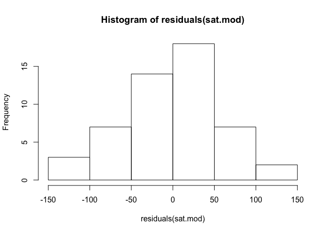
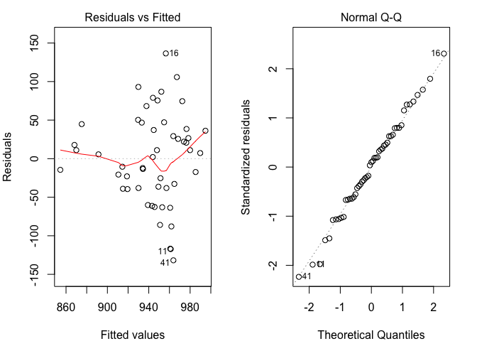
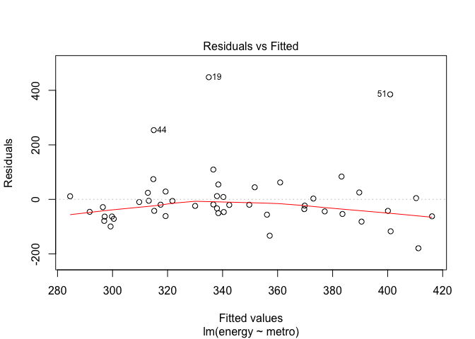
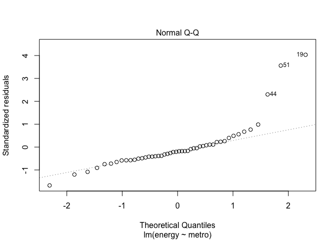
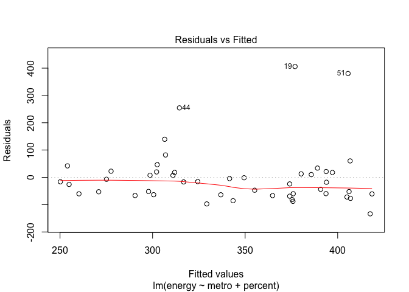
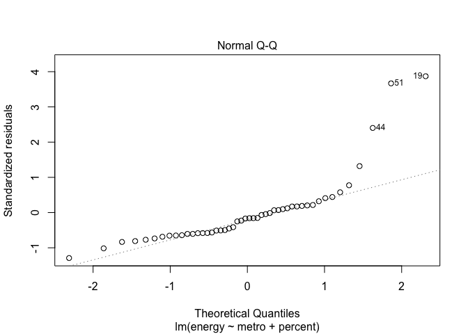
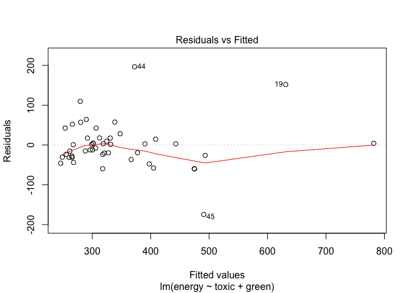
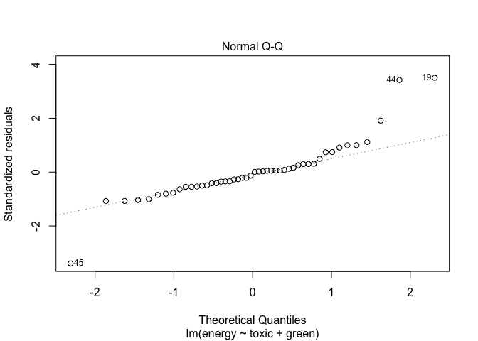
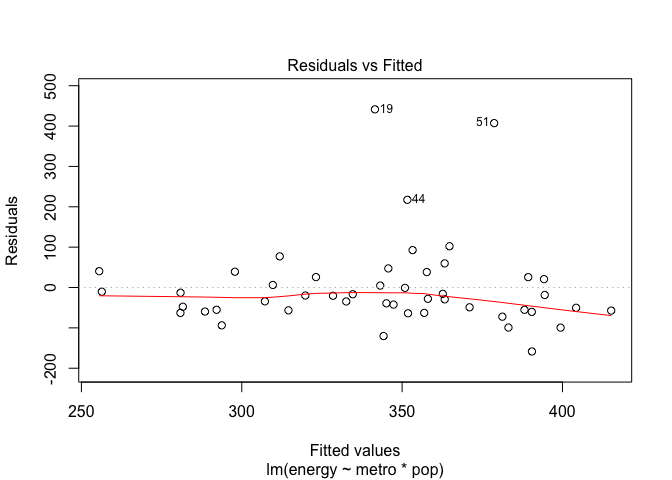
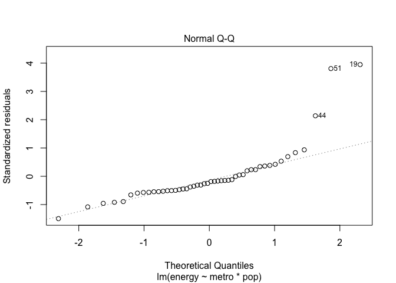

README
================
Rajesh Jagannath
July 29, 2016

R Markdown
----------

This is an R Markdown document. Markdown is a simple formatting syntax for authoring HTML, PDF, and MS Word documents. For more details on using R Markdown see <http://rmarkdown.rstudio.com>.

When you click the **Knit** button a document will be generated that includes both content as well as the output of any embedded R code chunks within the document. You can embed an R code chunk like this:

Introduction
============

══════════════
--------------

• Learning objectives: • Learn the R formula interface • Specify factor contrasts to test specific hypotheses • Perform model comparisons • Run and interpret variety of regression models in R

Set working directory ─────────────────────────

It is often helpful to start your R session by setting your working directory so you don't have to type the full path names to your data and other files set the working directory setwd("~/Desktop/Rstatistics") setwd("C:/Users/dataclass/Desktop/Rstatistics")

You might also start by listing the files in your working directory

getwd() \# where am I? setwd("/Users/rajesh/Desktop/Coursera/SpringBoardGithub/linear\_regression") list.files("dataSets") \# files in the dataSets folder

#### Load the states data

#### ────────────────────────

read the states data

``` r
states.data <- readRDS("dataSets/states.rds")
```

get labels

``` r
states.info <- data.frame(attributes(states.data)[c("names", "var.labels")])
#look at last few labels
tail(states.info, 8)
```

    ##      names                      var.labels
    ## 14    csat        Mean composite SAT score
    ## 15    vsat           Mean verbal SAT score
    ## 16    msat             Mean math SAT score
    ## 17 percent       % HS graduates taking SAT
    ## 18 expense Per pupil expenditures prim&sec
    ## 19  income Median household income, $1,000
    ## 20    high             % adults HS diploma
    ## 21 college         % adults college degree

Linear regression
-----------------

═══════════════════

Examine the data before fitting models ──────────────────────────────────────────

Start by examining the data to check for problems.

summary of expense and csat columns, all rows

``` r
sts.ex.sat <- subset(states.data, select = c("expense", "csat"))
summary(sts.ex.sat)
```

    ##     expense          csat       
    ##  Min.   :2960   Min.   : 832.0  
    ##  1st Qu.:4352   1st Qu.: 888.0  
    ##  Median :5000   Median : 926.0  
    ##  Mean   :5236   Mean   : 944.1  
    ##  3rd Qu.:5794   3rd Qu.: 997.0  
    ##  Max.   :9259   Max.   :1093.0

correlation between expense and csat

``` r
cor(sts.ex.sat)
```

    ##            expense       csat
    ## expense  1.0000000 -0.4662978
    ## csat    -0.4662978  1.0000000

Plot the data before fitting models
-----------------------------------

───────────────────────────────────────

Plot the data to look for multivariate outliers, non-linear relationships etc.

scatter plot of expense vs csat

``` r
plot(sts.ex.sat)
```


Linear regression example
-------------------------

─────────────────────────────

• Linear regression models can be fit with the `lm()' function    • For example, we can use`lm' to predict SAT scores based on per-pupal expenditures:

### Fit our regression model

``` r
sat.mod <- lm(csat ~ expense, data=states.data) 
```

Summarize and print the results

``` r
summary(sat.mod) # show regression coefficients table
```

    ## 
    ## Call:
    ## lm(formula = csat ~ expense, data = states.data)
    ## 
    ## Residuals:
    ##      Min       1Q   Median       3Q      Max 
    ## -131.811  -38.085    5.607   37.852  136.495 
    ## 
    ## Coefficients:
    ##               Estimate Std. Error t value Pr(>|t|)    
    ## (Intercept)  1.061e+03  3.270e+01   32.44  < 2e-16 ***
    ## expense     -2.228e-02  6.037e-03   -3.69 0.000563 ***
    ## ---
    ## Signif. codes:  0 '***' 0.001 '**' 0.01 '*' 0.05 '.' 0.1 ' ' 1
    ## 
    ## Residual standard error: 59.81 on 49 degrees of freedom
    ## Multiple R-squared:  0.2174, Adjusted R-squared:  0.2015 
    ## F-statistic: 13.61 on 1 and 49 DF,  p-value: 0.0005631

### Why is the association between expense and SAT scores /negative/?

──────────────────────────────────────────────────────

Many people find it surprising that the per-capita expenditure on students is negatively related to SAT scores. The beauty of multiple regression is that we can try to pull these apart. What would the association between expense and SAT scores be if there were no difference among the states in the percentage of students taking the SAT?

``` r
summary(lm(csat ~ expense + percent, data = states.data))
```

    ## 
    ## Call:
    ## lm(formula = csat ~ expense + percent, data = states.data)
    ## 
    ## Residuals:
    ##     Min      1Q  Median      3Q     Max 
    ## -62.921 -24.318   1.741  15.502  75.623 
    ## 
    ## Coefficients:
    ##               Estimate Std. Error t value Pr(>|t|)    
    ## (Intercept) 989.807403  18.395770  53.806  < 2e-16 ***
    ## expense       0.008604   0.004204   2.046   0.0462 *  
    ## percent      -2.537700   0.224912 -11.283 4.21e-15 ***
    ## ---
    ## Signif. codes:  0 '***' 0.001 '**' 0.01 '*' 0.05 '.' 0.1 ' ' 1
    ## 
    ## Residual standard error: 31.62 on 48 degrees of freedom
    ## Multiple R-squared:  0.7857, Adjusted R-squared:  0.7768 
    ## F-statistic: 88.01 on 2 and 48 DF,  p-value: < 2.2e-16

### The lm class and methods

────────────────────────────

OK, we fit our model. Now what? • Examine the model object:

``` r
class(sat.mod)
```

    ## [1] "lm"

``` r
names(sat.mod)
```

    ##  [1] "coefficients"  "residuals"     "effects"       "rank"         
    ##  [5] "fitted.values" "assign"        "qr"            "df.residual"  
    ##  [9] "xlevels"       "call"          "terms"         "model"

What are residuals ?

``` r
sat.mod$residuals
```

    ##           1           2           3           4           5           6 
    ##   11.061321   44.823681  -32.746689   26.687443  -63.692521   11.071423 
    ##           7           8           9          10          11          12 
    ##    5.607011  -38.085785  -14.482245  -61.206140 -117.249412  -62.656461 
    ##          13          14          15          16          17          18 
    ##  -17.307109   68.229118  -85.913513  136.495300   86.839051   29.255715 
    ##          19          20          21          22          23          24 
    ##   25.622381  -60.151972  -10.470558  -22.925687   50.315177   78.969661 
    ##          25          26          27          28          29          30 
    ##    7.260037   47.165973   37.190014   75.492257  -38.083867  -13.384984 
    ##          31          32          33          34          35          36 
    ##   17.840509   22.031194   11.058457 -116.759348  105.802990    2.103315 
    ##          37          38          39          40          41          42 
    ##   20.714527  -12.139952  -39.027449  -39.438026 -131.811112   74.590489 
    ##          43          44          45          46          47          48 
    ##   38.514046  -87.873131   36.203466  -20.639147  -63.007424  -36.354218 
    ##          49          50          51 
    ##  -25.336750   93.047869   46.751074

``` r
methods(class = class(sat.mod))[1:9]
```

    ## [1] "add1.lm"                   "alias.lm"                 
    ## [3] "anova.lm"                  "case.names.lm"            
    ## [5] "coerce,oldClass,S3-method" "confint.lm"               
    ## [7] "cooks.distance.lm"         "deviance.lm"              
    ## [9] "dfbeta.lm"

• Use function methods to get more information about the fit

``` r
confint(sat.mod)
```

    ##                    2.5 %        97.5 %
    ## (Intercept) 995.01753164 1126.44735626
    ## expense      -0.03440768   -0.01014361

``` r
 hist(residuals(sat.mod))
```



### Linear Regression Assumptions

─────────────────────────────────

• Ordinary least squares regression relies on several assumptions, including that the residuals are normally distributed and homoscedastic, the errors are independent and the relationships are linear.

• Investigate these assumptions visually by plotting your model:

``` r
par(mar = c(4, 4, 2, 2), mfrow = c(1, 2)) #optional
plot(sat.mod, which = c(1, 2)) # "which" argument optional
```

 \#\#\# Comparing models ────────────────────

Do congressional voting patterns predict SAT scores over and above expense? Fit two models and compare them:

fit another model, adding house and senate as predictor

``` r
sat.voting.mod <-  lm(csat ~ expense + house + senate,
                      data = na.omit(states.data))
sat.mod <- update(sat.mod, data=na.omit(states.data))
# compare using the anova() function
anova(sat.mod, sat.voting.mod)
```

    ## Analysis of Variance Table
    ## 
    ## Model 1: csat ~ expense
    ## Model 2: csat ~ expense + house + senate
    ##   Res.Df    RSS Df Sum of Sq      F  Pr(>F)  
    ## 1     46 169050                              
    ## 2     44 149284  2     19766 2.9128 0.06486 .
    ## ---
    ## Signif. codes:  0 '***' 0.001 '**' 0.01 '*' 0.05 '.' 0.1 ' ' 1

``` r
coef(summary(sat.voting.mod))
```

    ##                  Estimate   Std. Error    t value     Pr(>|t|)
    ## (Intercept) 1082.93438041 38.633812740 28.0307405 1.067795e-29
    ## expense       -0.01870832  0.009691494 -1.9303852 6.001998e-02
    ## house         -1.44243754  0.600478382 -2.4021473 2.058666e-02
    ## senate         0.49817861  0.513561356  0.9700469 3.373256e-01

### Exercise: least squares regression

────────────────────────────────────────

Use the /states.rds/ data set. Fit a model predicting energy consumed per capita (energy) from the percentage of residents living in metropolitan areas (metro). Be sure to 1. Examine/plot the data before fitting the model 2. Print and interpret the model `summary'    3.`plot' the model to look for deviations from modeling assumptions

``` r
sat.energy.mod <- lm( energy ~ metro, data = na.omit(states.data))
summary(sat.energy.mod)
```

    ## 
    ## Call:
    ## lm(formula = energy ~ metro, data = na.omit(states.data))
    ## 
    ## Residuals:
    ##     Min      1Q  Median      3Q     Max 
    ## -179.17  -54.21  -21.64   15.07  448.02 
    ## 
    ## Coefficients:
    ##             Estimate Std. Error t value Pr(>|t|)    
    ## (Intercept) 449.8382    50.4472   8.917 1.37e-11 ***
    ## metro        -1.6526     0.7428  -2.225    0.031 *  
    ## ---
    ## Signif. codes:  0 '***' 0.001 '**' 0.01 '*' 0.05 '.' 0.1 ' ' 1
    ## 
    ## Residual standard error: 112.3 on 46 degrees of freedom
    ## Multiple R-squared:  0.09714,    Adjusted R-squared:  0.07751 
    ## F-statistic: 4.949 on 1 and 46 DF,  p-value: 0.03105

``` r
plot(sat.energy.mod, which = c(1,2) )
```

 Select one or more additional predictors to add to your model and repeat steps 1-3. Is this model significantly better than the model with /metro/ as the only predictor? \#\#\#\#\# selected metro and percent as additional predictors

``` r
sat.energy2.mod <- lm( energy ~ metro + percent, data = na.omit(states.data))
summary(sat.energy2.mod)
```

    ## 
    ## Call:
    ## lm(formula = energy ~ metro + percent, data = na.omit(states.data))
    ## 
    ## Residuals:
    ##     Min      1Q  Median      3Q     Max 
    ## -133.58  -61.30  -17.35   18.54  406.03 
    ## 
    ## Coefficients:
    ##             Estimate Std. Error t value Pr(>|t|)    
    ## (Intercept) 450.5644    48.4005   9.309 4.66e-12 ***
    ## metro        -0.8665     0.7951  -1.090   0.2816    
    ## percent      -1.4854     0.6660  -2.230   0.0307 *  
    ## ---
    ## Signif. codes:  0 '***' 0.001 '**' 0.01 '*' 0.05 '.' 0.1 ' ' 1
    ## 
    ## Residual standard error: 107.8 on 45 degrees of freedom
    ## Multiple R-squared:  0.187,  Adjusted R-squared:  0.1509 
    ## F-statistic: 5.176 on 2 and 45 DF,  p-value: 0.00948

``` r
plot(sat.energy2.mod, which = c(1,2) )
```



RSE of 2nd model is lower. RSE provides an absolute measure of lack of fit of the model to the data measured in the units of Y(energy)=&gt; lower mean better R2 is a proportion - R2 near zero does not explain much of variability in the response model is wrong or variance is high =&gt; both have near 0 R2 F-stat : if the relationship is &gt; 5, there is some relationship between response and predictors and the second model seems better Based on t statistics and Pr(|t|) both the models are equally weak " Looks like, both models are pretty weak. Though you are getting one variable significant for each, but note that their significant(contributions) are vary less. For 'metro' it's -1.6 and for 'percent' it's -1.4. In both cases, intercept is very high, which means all contribution to R-square (or adjusted R-square) is due to intercept only.

#### Since the model is weak let us explore the interaction of all variables

``` r
sat.energy_all.mod <- lm( energy ~ pop + area +density +metro + waste + miles +toxic + green +house + senate + csat +vsat +msat + percent + expense + income + high , data = na.omit(states.data))
 

summary(sat.energy_all.mod)
```

    ## 
    ## Call:
    ## lm(formula = energy ~ pop + area + density + metro + waste + 
    ##     miles + toxic + green + house + senate + csat + vsat + msat + 
    ##     percent + expense + income + high, data = na.omit(states.data))
    ## 
    ## Residuals:
    ##      Min       1Q   Median       3Q      Max 
    ## -128.432  -27.796   -2.684   27.326  154.965 
    ## 
    ## Coefficients: (1 not defined because of singularities)
    ##               Estimate Std. Error t value Pr(>|t|)    
    ## (Intercept)  2.490e+02  4.390e+02   0.567 0.574626    
    ## pop         -1.923e-06  3.579e-06  -0.537 0.594954    
    ## area         5.512e-04  3.583e-04   1.539 0.134056    
    ## density     -2.742e-02  8.828e-02  -0.311 0.758144    
    ## metro        5.306e-01  9.403e-01   0.564 0.576624    
    ## waste        1.374e+01  5.439e+01   0.253 0.802308    
    ## miles        8.559e+00  1.489e+01   0.575 0.569613    
    ## toxic        2.674e+00  6.670e-01   4.009 0.000356 ***
    ## green        4.518e+00  9.533e-01   4.740 4.53e-05 ***
    ## house        1.217e-01  9.941e-01   0.122 0.903371    
    ## senate       5.679e-02  6.377e-01   0.089 0.929610    
    ## csat        -2.346e-01  2.064e+00  -0.114 0.910257    
    ## vsat         3.662e-01  4.319e+00   0.085 0.932976    
    ## msat                NA         NA      NA       NA    
    ## percent      1.017e-01  1.304e+00   0.078 0.938345    
    ## expense      1.445e-02  1.555e-02   0.929 0.360186    
    ## income      -5.978e-01  4.482e+00  -0.133 0.894752    
    ## high        -2.877e+00  3.372e+00  -0.853 0.399984    
    ## ---
    ## Signif. codes:  0 '***' 0.001 '**' 0.01 '*' 0.05 '.' 0.1 ' ' 1
    ## 
    ## Residual standard error: 63.41 on 31 degrees of freedom
    ## Multiple R-squared:  0.8061, Adjusted R-squared:  0.706 
    ## F-statistic: 8.055 on 16 and 31 DF,  p-value: 4.568e-07

``` r
plot(sat.energy_all.mod, which = c(1,2) )
```


``` r
plot(sat.energy_all.mod)
```


### optimize the model by selecting green and toxic as predictors

``` r
sat.energy_grn_txc.mod <- lm( energy ~  toxic + green , data = na.omit(states.data))
 

summary(sat.energy_grn_txc.mod)
```

    ## 
    ## Call:
    ## lm(formula = energy ~ toxic + green, data = na.omit(states.data))
    ## 
    ## Residuals:
    ##      Min       1Q   Median       3Q      Max 
    ## -174.763  -28.685   -3.589   17.280  196.598 
    ## 
    ## Coefficients:
    ##             Estimate Std. Error t value Pr(>|t|)    
    ## (Intercept) 179.8260    16.1194  11.156 1.51e-14 ***
    ## toxic         2.6455     0.4676   5.657 1.01e-06 ***
    ## green         4.6722     0.5336   8.756 2.81e-11 ***
    ## ---
    ## Signif. codes:  0 '***' 0.001 '**' 0.01 '*' 0.05 '.' 0.1 ' ' 1
    ## 
    ## Residual standard error: 58.23 on 45 degrees of freedom
    ## Multiple R-squared:  0.7627, Adjusted R-squared:  0.7521 
    ## F-statistic:  72.3 on 2 and 45 DF,  p-value: 8.835e-15

### SUMMARY : Indicates the intercept, green and toxic are all significant

              p values are low - we accept the Ha - Hypothesis - there is at least one significant predictor
              Adjusted r_sqr is 0.75 .. which is high
              p-value for Fstat is low

### Appears to be a GOOD Model

``` r
plot(sat.energy_grn_txc.mod, which = c(1,2) )
```



Interactions and factors
------------------------

══════════════════════════

#### Modeling interactions

─────────────────────────

Interactions allow us assess the extent to which the association between one predictor and the outcome depends on a second predictor. For example: Does the association between expense and SAT scores depend on the median income in the state?

#### Add the interaction to the model

``` r
sat.expense.by.percent <- lm(csat ~ expense*income,
                             data=states.data) 

#Show the results
  coef(summary(sat.expense.by.percent)) # show regression coefficients table
```

    ##                     Estimate   Std. Error   t value     Pr(>|t|)
    ## (Intercept)     1.380364e+03 1.720863e+02  8.021351 2.367069e-10
    ## expense        -6.384067e-02 3.270087e-02 -1.952262 5.687837e-02
    ## income         -1.049785e+01 4.991463e+00 -2.103161 4.083253e-02
    ## expense:income  1.384647e-03 8.635529e-04  1.603431 1.155395e-01

#### Regression with categorical predictors

──────────────────────────────────────────

Let's try to predict SAT scores from region, a categorical variable. Note that you must make sure R does not think your categorical variable is numeric.

make sure R knows region is categorical

``` r
str(states.data$region)
```

    ##  Factor w/ 4 levels "West","N. East",..: 3 1 1 3 1 1 2 3 NA 3 ...

``` r
states.data$region <- factor(states.data$region)
```

Add region to the model

``` r
sat.region <- lm(csat ~ region,
                 data=states.data) 

#Show the results
coef(summary(sat.region)) # show regression coefficients table
```

    ##                Estimate Std. Error    t value     Pr(>|t|)
    ## (Intercept)   946.30769   14.79582 63.9577807 1.352577e-46
    ## regionN. East -56.75214   23.13285 -2.4533141 1.800383e-02
    ## regionSouth   -16.30769   19.91948 -0.8186806 4.171898e-01
    ## regionMidwest  63.77564   21.35592  2.9863209 4.514152e-03

``` r
anova(sat.region) # show ANOVA table
```

    ## Analysis of Variance Table
    ## 
    ## Response: csat
    ##           Df Sum Sq Mean Sq F value    Pr(>F)    
    ## region     3  82049 27349.8  9.6102 4.859e-05 ***
    ## Residuals 46 130912  2845.9                      
    ## ---
    ## Signif. codes:  0 '***' 0.001 '**' 0.01 '*' 0.05 '.' 0.1 ' ' 1

Again, *make sure to tell R which variables are categorical by converting them to factors!*

#### Setting factor reference groups and contrasts

─────────────────────────────────────────────────

In the previous example we use the default contrasts for region. The default in R is treatment contrasts, with the first level as the reference. We can change the reference group or use another coding scheme using the \`C' function.

print default contrasts

``` r
contrasts(states.data$region)
```

    ##         N. East South Midwest
    ## West          0     0       0
    ## N. East       1     0       0
    ## South         0     1       0
    ## Midwest       0     0       1

``` r
# change the reference group
coef(summary(lm(csat ~ C(region, base=4),
                data=states.data)))
```

    ##                        Estimate Std. Error   t value     Pr(>|t|)
    ## (Intercept)          1010.08333   15.39998 65.589930 4.296307e-47
    ## C(region, base = 4)1  -63.77564   21.35592 -2.986321 4.514152e-03
    ## C(region, base = 4)2 -120.52778   23.52385 -5.123641 5.798399e-06
    ## C(region, base = 4)3  -80.08333   20.37225 -3.931000 2.826007e-04

``` r
# change the coding scheme
coef(summary(lm(csat ~ C(region, contr.helmert),
                data=states.data)))
```

    ##                             Estimate Std. Error     t value     Pr(>|t|)
    ## (Intercept)               943.986645   7.706155 122.4977451 1.689670e-59
    ## C(region, contr.helmert)1 -28.376068  11.566423  -2.4533141 1.800383e-02
    ## C(region, contr.helmert)2   4.022792   5.884552   0.6836191 4.976450e-01
    ## C(region, contr.helmert)3  22.032229   4.446777   4.9546509 1.023364e-05

See also `?contrasts',`?contr.treatment', and \`?relevel'.

Exercise: interactions and factors
----------------------------------

────────────────────────────────────────

Use the states data set.

1.  Add on to the regression equation that you created in exercise 1 by generating an interaction term and testing the interaction.

``` r
sat.energy.by.pop.mod <- lm( energy ~ metro*pop, data = na.omit(states.data))
summary(sat.energy.by.pop.mod)
```

    ## 
    ## Call:
    ## lm(formula = energy ~ metro * pop, data = na.omit(states.data))
    ## 
    ## Residuals:
    ##     Min      1Q  Median      3Q     Max 
    ## -158.48  -56.72  -24.24   25.73  441.48 
    ## 
    ## Coefficients:
    ##               Estimate Std. Error t value Pr(>|t|)    
    ## (Intercept)  4.130e+02  6.569e+01   6.287 1.28e-07 ***
    ## metro       -1.431e+00  9.629e-01  -1.486    0.144    
    ## pop          2.596e-05  2.527e-05   1.027    0.310    
    ## metro:pop   -2.782e-07  2.744e-07  -1.014    0.316    
    ## ---
    ## Signif. codes:  0 '***' 0.001 '**' 0.01 '*' 0.05 '.' 0.1 ' ' 1
    ## 
    ## Residual standard error: 113.5 on 44 degrees of freedom
    ## Multiple R-squared:  0.1183, Adjusted R-squared:  0.05818 
    ## F-statistic: 1.968 on 3 and 44 DF,  p-value: 0.1327

``` r
plot(sat.energy.by.pop.mod, which = c(1,2) )
```



1.  Try adding region to the model. Are there significant differences across the four regions?

``` r
coef(summary(lm(energy ~ C(region, base=4) + (metro * pop),
                data=states.data)))
```

    ##                           Estimate   Std. Error     t value     Pr(>|t|)
    ## (Intercept)           4.638087e+02 9.570898e+01  4.84603127 1.673354e-05
    ## C(region, base = 4)1  6.238184e+01 6.391249e+01  0.97605074 3.344987e-01
    ## C(region, base = 4)2 -7.099946e+01 7.001605e+01 -1.01404559 3.162331e-01
    ## C(region, base = 4)3  4.041508e+01 5.365505e+01  0.75323906 4.554108e-01
    ## metro                -1.935061e+00 1.179812e+00 -1.64014323 1.082717e-01
    ## pop                  -2.343951e-06 4.012547e-05 -0.05841553 9.536883e-01
    ## metro:pop             2.583434e-08 4.336186e-07  0.05957848 9.527674e-01

### Ans: Region 3 has high correlation to metro and population

Note that the `echo = FALSE` parameter was added to the code chunk to prevent printing of the R code that generated the plot.
